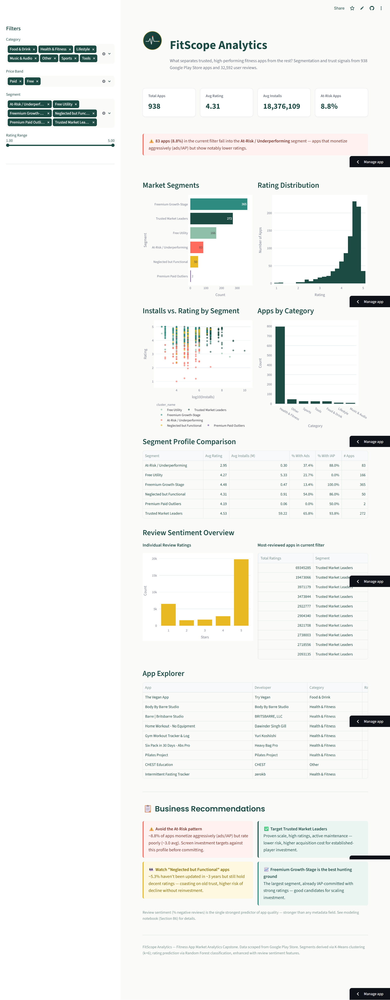
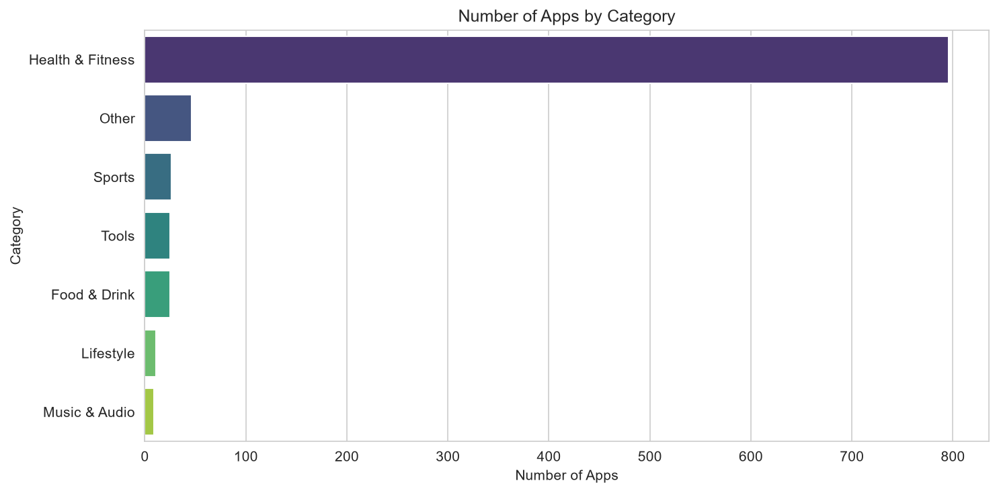
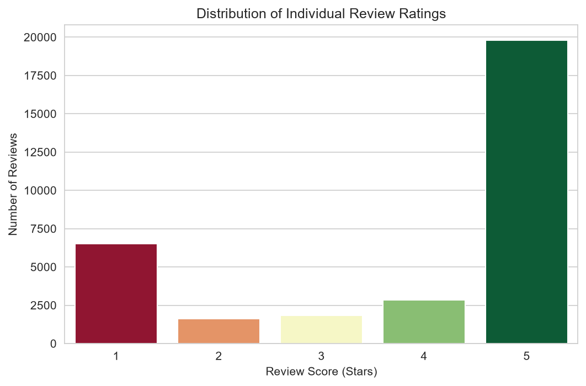

# 🏃 FitScope Analytics — Fitness App Market Analytics

**End-to-end data science capstone**: scraping, cleaning, EDA, machine learning, and an interactive dashboard analyzing the Google Play Store fitness app market — uncovering what separates trusted, high-performing apps from the rest.

## 🔗 Live Dashboard

**[https://playstore-fitness-app-analytics.streamlit.app/](https://playstore-fitness-app-analytics.streamlit.app/)**

*(Free-tier hosting — if the app is asleep, click to wake it up; takes ~30 seconds.)*

---

## 📌 Business Problem

Acting as a Data Science Consultant for a hypothetical digital wellness investment firm, this project answers:

1. What combination of features (pricing, category, update frequency, monetization) drives higher ratings and engagement?
2. Can fitness apps be meaningfully segmented into groups like "trusted premium," "high-growth freemium," or "at-risk/declining"?
3. What do user reviews reveal about the biggest drivers of dissatisfaction — and can this act as an early warning signal?
4. What would you recommend to a company building or investing in a fitness app?

---

## 🔑 Key Findings

- **No single metadata field strongly predicts rating** (highest correlation with `score` was just 0.10) — but combinations of features reveal real structure.
- **6 distinct market segments** emerged via clustering, including a critical **At-Risk / Underperforming** segment (~9% of apps) that monetizes aggressively but rates poorly (~3.0 avg) — invisible until testing k=6 instead of a simpler k=4.
- **Review sentiment beats app metadata for predicting quality.** Adding review-derived features (like % negative reviews) lifted classification accuracy from ~43% to ~62% — `pct_negative_reviews` became the single strongest predictor, ahead of every metadata field.
- **Reviews follow a bimodal pattern**: ~61% are 5-star, but ~20% are 1-star — users who bother to review tend to feel strongly, which can hide a real dissatisfied minority behind a healthy-looking average rating.
- **Monetization (ads/IAP) does not hurt ratings** — apps with ads/IAP actually average slightly *higher* ratings, likely because well-resourced apps can both monetize and deliver quality.
- **Update recency is not a reliable trust signal** on its own (correlation ≈ -0.055) — but combined with other features, it still contributes meaningfully to prediction.

---

## 📸 Dashboard & Key Visuals



*Market segmentation breakdown — 6 distinct app segments identified via K-Means clustering:*



*Review sentiment shows a bimodal pattern — users tend to feel strongly, either very satisfied or very frustrated:*



## 🗂️ Project Structure

```
playstore-fitness-app-analytics/
├── data/
│   ├── raw/                       # Raw scraped data
│   │   ├── raw_apps.csv
│   │   └── raw_reviews.csv
│   └── processed/                 # Cleaned & modeled data
│       ├── cleaned_apps.csv
│       ├── cleaned_reviews.csv
│       └── apps_with_clusters.csv
├── scripts/
│   └── 01_scrape_playstore.py     # Phase 1: Web scraping
├── notebooks/
│   ├── 02_data_cleaning_eda.ipynb # Phase 2 & 3: Cleaning + EDA
│   └── 03_modeling.ipynb          # Phase 4: Clustering + Classification
├── dashboard/
│   ├── app.py                     # Streamlit dashboard
│   └── assets/
│       ├── logo.png / logo.svg
│       ├── BRAND_KIT.md
│       └── powerbi_theme.json
├── report/
│   ├── screenshots/                # Chart exports for report/README
│   └── final_report.pdf
├── requirements.txt
└── README.md
```

---

## 🛠️ Tech Stack

| Purpose | Tools |
|---|---|
| Web Scraping | Python, `google-play-scraper` |
| Data Cleaning & EDA | pandas, numpy, matplotlib, seaborn |
| Machine Learning | scikit-learn (K-Means clustering, Random Forest classification) |
| Dashboard | Streamlit, Plotly, Power BI |
| Notebooks | Jupyter |

---

## 📊 Methodology

### Phase 1 — Web Scraping
Scraped Google Play Store fitness/wellness apps using 65+ search terms across sub-niches (workout types, equipment, diets, sub-audiences) to reach 1,197 unique apps and 34,000+ user reviews — no login required, public listings only.

### Phase 2 — Data Cleaning & Preprocessing
- Dropped empty/redundant columns, validated data ranges, investigated duplicate titles (confirmed genuine competing apps, not scraping errors)
- Dropped 259 apps with no public rating yet (259/1197 ≈ 22%) → **938 apps** retained for rating-based analysis
- Engineered features: `price_band`, `rating_tier`, `install_tier`, `days_since_update`, `app_age_days`, `description_length`, `category_grouped`
- Cleaned review text (HTML tags, encoding artifacts), filtered reviews to match retained apps → **33,010 reviews**

### Phase 3 — Exploratory Data Analysis
8 visualizations across the apps table (category distribution, rating distribution, price/installs/monetization vs. rating, correlation heatmap) plus dedicated review-level sentiment analysis — every finding verified against actual computed statistics.

### Phase 4 — The Dual-Model Strategy: Segment & Predict
- **Segment (K-Means clustering, k=6):** Selected via silhouette analysis — critically, k=6 was chosen over a simpler k=4 because it recovers a real, business-relevant "At-Risk" segment that disappears at lower k. Produces 6 named market segments with business recommendations for each.
- **Predict (Random Forest classification):** Predicts `rating_tier` from app features, carefully avoiding data leakage (excludes `score`/`ratings` from features). Honestly evaluated: ~43% accuracy from metadata alone, improving to ~62% when review-sentiment features are added — proving user reviews carry more predictive signal than store metadata.

### Phase 5 — Interactive Dashboards
- **Streamlit** (Python): live, filterable dashboard with KPIs, segment visualizations, review sentiment, and business recommendations — [live link above](#-live-dashboard)
- **Power BI**: matching brand theme, with KPIs, drill-through, bookmarks, and sync slicers

---

## 🚀 Setup & Run

```bash
git clone https://github.com/mrudula-jujjuru/playstore-fitness-app-analytics.git
cd playstore-fitness-app-analytics
pip install -r requirements.txt
```

**Re-run the pipeline (optional — cleaned data is already included in the repo):**
```bash
python scripts/01_scrape_playstore.py        # Phase 1 (requires internet access to play.google.com)
# Open and run notebooks/02_data_cleaning_eda.ipynb    # Phase 2 & 3
# Open and run notebooks/03_modeling.ipynb             # Phase 4
```

**Run the dashboard locally:**
```bash
cd dashboard
streamlit run app.py
```

---

## 📋 Business Recommendations Summary

1. **Screen against the At-Risk pattern** — apps monetizing aggressively without matching quality investment (high ads/IAP, low rating) are a recognizable, avoidable red flag for investment due diligence.
2. **Watch "Neglected but Functional" apps** — apps coasting on old trust without recent updates are a higher-risk hold, not a safe one.
3. **Target "Trusted Market Leaders"** for lower-risk, established-player investment.
4. **"Freemium Growth-Stage" is the best hunting ground** for scaling investment — largest segment, already committed to IAP monetization with strong ratings.
5. **Monitor review sentiment continuously** — it's a stronger, earlier warning signal than any static metadata field.

---

## 👤 Author

**Mrudula Jujjuru**
Data Science & AI/ML | Former Android/Embedded Systems Engineer | Entrepreneur

🔗 [LinkedIn](https://www.linkedin.com/in/mrudula-jujjuru/)

---

*This project was built as a Data Science capstone, demonstrating an end-to-end workflow from raw web data to decision-ready business intelligence.*
